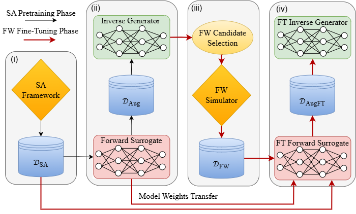

[](https://opensource.org/licenses/MIT)
[](https://huggingface.co/datasets/nati-nissan/MetaMamba)

# Harnessing Selective State Space Models to Enhance Semianalytical Design of Fabrication-Ready Multilayered Huygens' Metasurfaces

A data-driven design system for metamaterial surfaces. Given a target electromagnetic response (e.g, transmission magnitude and phase), MetaMamba generates the unit-cell geometry that realizes it — and vice versa.

This repository is the codebase accompanying the following articles:
- Part I: *Harnessing Selective State Space Models to Enhance Semianalytical Design of Fabrication-Ready Multilayered Huygens' Metasurfaces: Part I - Field-based Semianalytical Synthesis* 
[](https://arxiv.org/abs/2603.03837)
- Part II: *Harnessing Selective State Space Models to Enhance Semianalytical Design of Fabrication-Ready Multilayered Huygens' Metasurfaces: Part II - Generative Inverse Design (MetaMamba)*
[](https://arxiv.org/abs/2603.03877)

> **Citations (arXiv / BibTeX)**

We kindly ask that any use of this repository's content cite both Part I and Part II articles.

```bibtex
@misc{marcus2026harnessingselectivestatespace,
    title={Harnessing Selective State Space Models to Enhance Semianalytical Design of Fabrication-Ready Multilayered Huygens' Metasurfaces: Part I - Field-based Semianalytical Synthesis},
    author={Sherman W. Marcus and Natanel Nissan and Vinay K. Killamsetty and Ravi Yadav and Dan Raviv and Raja Giryes and Ariel Epstein},
    year={2026},
    eprint={2603.03837},
    archivePrefix={arXiv},
    primaryClass={physics.app-ph},
    url={https://arxiv.org/abs/2603.03837},
}

@misc{nissan2026harnessingselectivestatespace,
    title={Harnessing Selective State Space Models to Enhance Semianalytical Design of Fabrication-Ready Multilayered Huygens' Metasurfaces: Part II - Generative Inverse Design (MetaMamba)},
    author={Natanel Nissan and Sherman W. Marcus and Dan Raviv and Raja Giryes and Ariel Epstein},
    year={2026},
    eprint={2603.03877},
    archivePrefix={arXiv},
    primaryClass={physics.app-ph},
    url={https://arxiv.org/abs/2603.03877},
}
```

---

## Pipeline Overview



*Fig. 2 from Part II: the four-stage MetaMamba pipeline. (i) Large semi-analytical dataset $\mathcal{D}_{SA}$ from LAYERS. (ii) Bi-Mamba forward surrogate pretrained on $\mathcal{D}_{SA}$; augmented dataset $\mathcal{D}_{Aug}$ generated; initial AR-Mamba inverse model trained. (iii) Small high-fidelity CST dataset $\mathcal{D}_{FW}$ collected. (iv) Bi-Mamba fine-tuned on $\mathcal{D}_{FW}$ with SA rehearsal; AR-Mamba retrained with the calibrated surrogate.*

---

## Background

A Jerusalem-cross (JC) unit cell is parameterized by five geometric leg lengths **W**. Their joint scattering response — transmission magnitude |T|² and phase φ — constitutes the **S parameters**. The forward problem predicts **S** from **W**; the inverse problem recovers **W** from a target **S**.

| Direction | Model | Architecture |
|-----------|-------|--------------|
| **Forward** **W** → **S** | `ForwardModel` | Bi-Mamba: bidirectional SSM regression |
| **Inverse** **S** → **W** | `MetaMambaLMHeadModel` | AR-Mamba: causal autoregressive LM |

Both share a Mamba2 SSM backbone.

---

## Semi-Analytical Model (LAYERS)

The semi-analytical model used to generate $\mathcal{D}_{SA}$ is developed in Part I and implemented as the LAYERS MATLAB app (`LAYERS/layers_App.mlapp`). See `LAYERS/layersProgram.pptx` for interactive usage.

---

## Dataset

The raw datasets used across all pipeline stages are publicly available on Hugging Face:

👉 **[nati-nissan/MetaMamba](https://huggingface.co/datasets/nati-nissan/MetaMamba)**

| File | Description |
|------|-------------|
| `sa_dataset_20ghz.csv` | ~524K SA-generated single-frequency samples |
| `cst_dataset_20ghz.csv` | 1,080 full-wave CST samples at 20 GHz |
| `sa_freq_resp_18_to_22.csv` | ~65K SA broadband frequency responses |
| `cst_freq_resp_18_to_22.csv` | 1,080 CST broadband frequency responses |


## Installation

```bash
pip install -r requirements.txt
```
---

## Configuration

All paths and hyperparameters are centralized in `config.yaml`. Fill in the path fields before running any script:

```yaml
runs_dir:              # root output directory for all training runs
data_path:             # semi-analytical CSV (used in steps i, ii, iv)
high_fid_path:         # full-wave CST/HFSS CSV (step iv fine-tuning)
low_fid_path:          # semi-analytical CSV for rehearsal (step iv)
lf_split_indices_path: # data_splits.npz from the step ii forward-model run
```

---

## Workflow

The workflow follows the four pipeline stages in Fig. 2 of Part II.

---

### Stage (i) — Generate the semi-analytical dataset $\mathcal{D}_{SA}$

$\mathcal{D}_{SA}$ is generated using the LAYERS app in headless mode. Two batch scripts drive data generation from a CSV of W-parameter rows.

**`run_Wk_sweep.m`** — single-frequency batch sweep.
Runs each W row through the LAYERS solver at the configured frequency and writes `Results_WkSweep.csv`. Supports chunked processing and automatic resume for large sweeps (default chunk size 1000).

```matlab
results = run_Wk_sweep('Wk_list.csv');
```

**`run_Wk_freq_response.m`** — per-case broadband frequency response.
For each W row sweeps 18–22 GHz (default 41 points), saving a per-case CSV (`detailed_case_####.csv`) of `freqGHz, efficiency, phaseDeg` plus a collated `detailed_summary.csv`.

```matlab
results = run_Wk_freq_response('Wk_list.csv', 'OutDir', 'WkFreqResults', ...
    'FreqMin', 18, 'FreqMax', 22, 'NumSamples', 41);
```

Both scripts require `jcross5.dat` (baseline geometry template) on the MATLAB path.

---

### Stage (ii) — Pretrain Bi-Mamba; augment data; train initial AR-Mamba

#### ii-a. Pretrain the Bi-Mamba forward surrogate on $\mathcal{D}_{SA}$

```bash
python train_forward.py
```

**`config.yaml` considerations:**
```yaml
data_path:   # path to D_SA CSV
runs_dir:    # checkpoint output root
epochs: 200
batch_size: 128
lr: 0.001
train_ratio: 0.7
val_ratio: 0.15
```

Outputs to `runs_dir/semi_analytical_based/train_forward_<timestamp>/`:
- `best_model.pth` — lowest val MSE checkpoint
- `data_splits.npz` — reproducible split indices (needed for step iv as `lf_split_indices_path`)
- `training_metrics.csv`

#### ii-b. Generate augmented dataset D_Aug

Uses the pretrained forward surrogate to label quasi-random Sobol samples of W space, producing synthetic (W, S) pairs without additional simulations.

```bash
python data/augment_with_forward.py
```

Point `data_path` at the generated `inverse_training_data.csv` before the next substep.

#### ii-c. Train the initial AR-Mamba inverse model

`MetaMambaLMHeadModel` is a causal LM over the mixed sequence `[S₁ S₂ S₃ | W₁ W₂ W₃ W₄ W₅]`. S tokens are continuous floats; W tokens are discrete indices (vocab size 81, 0–80 mils). Cross-entropy loss is applied only on W positions. Early stopping monitors S MAE, computed by running generated W through the forward surrogate.

```bash
python train_inverse.py
# resume a previous run:
python train_inverse.py --resume <checkpoint_dir>
```

**`config.yaml` considerations:**
```yaml
data_path:   # path to D_Aug CSV
runs_dir:    # checkpoint output root
early_stopping_metric: s_mae
early_stopping_patience: 5
```

Outputs to `runs_dir/inverse_<timestamp>/`:
- `best_model.pth`
- `training_metrics.csv`, `training.log`


### Stage (iii) — Candidate selection for CST with K-Means$

---
#### Parametric scan

Before selecting candidates, run a full grid sweep over (|T|², φ) target space. For each target point the inverse model generates W sequences (greedy + top-k sampling); each sequence is then passed through the forward surrogate to obtain the predicted realized response. Results are saved to a CSV and a polar plot.

```bash
python evaluations/evaluate_scan.py \
    --inverse_checkpoint_dir <inverse_run_dir> \
    --forward_model_path <forward_best_model.pth> \
    --output_csv scan_results.csv \
    --t_square_start 0.81 --t_square_stop 1.0 --t_square_step 0.01 \
    --phi_start 0 --phi_stop 360 --phi_step 2 \
    --top_k_value 20 --num_top_k_samples 1024 --disable_top_p_sampling
```

---

#### Candidate selection for CST with K-Means

After the scan, select diverse candidates from the generated pool for CST simulation.

`select_candidates_for_calibration.py` bins scan results by phase, clusters W vectors within each bin with KMeans, and picks top-k by |T|².

```bash
python evaluations/select_candidates_for_calibration.py \
    --input-csv <scan.csv> \
    --output-csv candidates.csv \
    --n-phase-bins 72 --n-clusters 15 \
    --emit-cst-txt
```
---

#### CST Simulation

Run full-wave CST simulations for a set of W configurations. Parse results into the same CSV structure as previous datasets.

---

### Stage (iv) — Calibrate Bi-Mamba; retrain AR-Mamba

#### iv-a. Fine-tune the Bi-Mamba forward surrogate on $\mathcal{D}_{FW}$

Adapts the pretrained surrogate to match full-wave simulation ground truth. A rehearsal mechanism interleaves low-fidelity (SA) batches every `rehearsal_interval` steps to prevent catastrophic forgetting of the SA distribution.

```bash
python fine_tune_forward.py
# use a fixed test set for ablation studies:
python fine_tune_forward.py --ablation
```

**`config.yaml` considerations:**
```yaml
high_fid_path:         # D_FW CSV
low_fid_path:          # D_SA CSV (rehearsal source)
lf_split_indices_path: # data_splits.npz from step ii-a
fine_tune_mode: "full" # "heads": decoder heads only | "full": backbone + heads
ft_epochs: 100
backbone_lr: 0.0001    # low LR for backbone in "full" mode
head_lr: 0.0005        # higher LR for decoder heads
rehearsal_lambda: 0.2  # weight of SA loss in combined objective
rehearsal_interval: 2  # one SA batch per N CST batches
alpha_weighted_val: 0.7 # weight of high-fid val in model selection metric
scheduler_ft: "cosine"  # cosine with warmup for "full" mode
```

Two checkpoints saved to `runs_dir/fine_tune/finetune_<mode>_<timestamp>/`:
- `best_high.pth` — best on high-fidelity (full-wave) validation loss alone
- `best_weighted.pth` — best on `$\alpha$ × high_val + (1 - $\alpha$) × low_val`

#### iv-b. Re-augment and retrain AR-Mamba with the calibrated surrogate

Re-run data augmentation using the fine-tuned forward surrogate to produce a higher-fidelity $\mathcal{D}_{Aug}$, then retrain the inverse model. The calibrated surrogate now provides more accurate S MAE feedback during validation, guiding the inverse model toward physically realizable designs.

```bash
python data/augment_with_forward.py  # re-run with fine-tuned forward checkpoint
python train_inverse.py
```

Use the same `config.yaml` as step ii-c, updating `data_path` to the newly generated CSV.